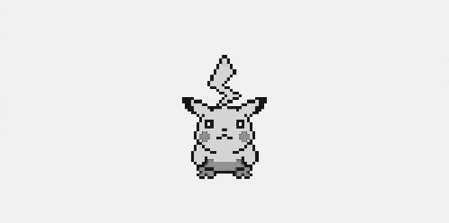

pikalang
========
A [brainfuck] [1] derivative based off the vocabulary of [Pikachu] [2] from [Pokémon] [3].




Syntax
------
| pikalang  | brainfuck | description                                    |
|-----------|-----------|------------------------------------------------|
| `pi`      | +         | increment the byte at pointer                  |
| `ka`      | -         | decrement the byte at pointer                  |
| `pika`    | [         | if pointer is zero, jump to matching `chu`     |
| `chu`     | ]         | if pointer is nonzero, jump to matching `pika` |
| `pipi`    | >         | increment the data pointer                     |
| `pichu`   | <         | decrement the data pointer                     |
| `pikapi`  | ,         | input of one byte into pointer                 |
| `pikachu` | .         | output the byte at pointer                     |


Installation
------------
```shell
	git clone https://github.com/skj3gg/pikalang.git
	cd pikalang

	python setup.py install
```


Usage
-----
```shell
	pikalang path/to/file.pokeball
```

You could also evaluate code from the command line, but it's a little ridiculous

```
	pikalang -e "pi pi pi pi pi pika pipi pi pi pi pi pi pi pi pi pi \
	pichu ka chu pikapi pika pika pipi ka ka pikachu pi pi pipi pi \
	pichu ka chu pipi pi pikachu ka pipi pika pichu pikachu pipi ka \
	chu pichu pikapi chu"
```


File Extention
--------------
A pikalang program is stored in a file with a `.pokeball` extention


Disclaimer
----------
This is a fan-based parody of themes from [Pokémon] [3]. The language,
as well as its author, is in no way associated with the Pokémon francise
and its creators, nor is this project, in any way, for-profit.


[1]: http://en.wikipedia.org/wiki/Brainfuck "Brainfuck"
[2]: https://www.google.com/search?q=pikachu&tbm=isch "Pikachu"
[3]: http://www.pokemon.com/ "Pokémon"
